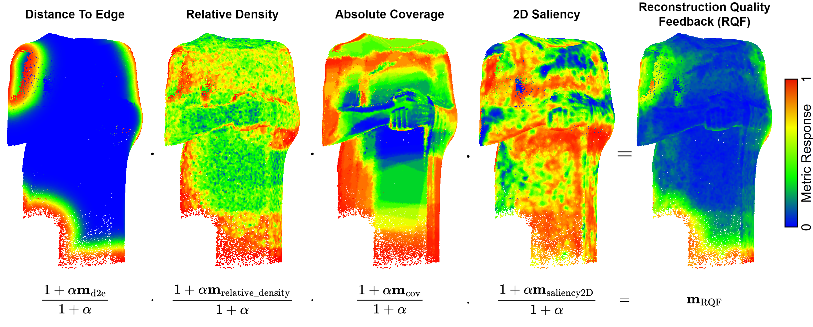

# Point cloud quality metrics for incremental image-based 3D reconstruction
Official repository for the article <b>Point cloud quality metrics for incremental image-based 3D reconstruction</b> that was published in the journal <b>Multimedia Tools and Applications</b> in January 2025.

[🌐 Project Page](https://kai-neumann.github.io/PointCloudMetrics/) | [📄Paper](https://link.springer.com/content/pdf/10.1007/s11042-025-20596-6.pdf)

## 1. Dataset Structure

There are in total 14 Models, all scaled to fit a cube of approximately 1x1x1 units (e.g. meters). Each model is located in a sub folder that contains the following data:

- <b>model.obj</b>: The model with UV coordinates that is used for rendering.
- <b>reference_model.ply</b>: The same model in ply format that is used as reference geometry
- <b>points.ply</b>: A point cloud of 1 million points that were sampled on the model
- <b>diffuse.png</b>: The diffuse texture

## 2. Download

The dataset can be downloaded [here](https://www.doi.org/10.6084/m9.figshare.25592400)

To reproduce the results shown in the paper, you additionally need to download the prebuilt simulation executable that runs the reconstructions in conjunction with view planning. It can be downloaded [here](https://owncloud.fraunhofer.de/index.php/s/Y3iXgfqHQjTCutF).

## 3. Benchmarks
The benchmark is split into two separate steps: 1.) Running simulations and 2.) evaluating the simulation results. To execute them the repository first needs to be cloned using
> git clone https://github.com/kai-neumann/PointCloudMetrics.git

### 3.1 Running Simulations
The simulations can be run automatically using the provided python script <b>run_simulations.py</b>. It requires the user to specify the path to the dataset and simulation executable as well as an output folder. Additionally, [Blender](https://www.blender.org/) is used for generating photorealisitc images as part of the view-planning loop. The code was tested with Blender 3.6, but should generalize well to newer versions. 

> python run_simulations.py --dataset {DATASET PATH} --executable-folder {SIMULATION EXECUTABLE FOLDER} --blender {BLENDER EXECUTABLE PATH} --ouput-folder {OUTPUT FOLDER}

Important Note: Due to the large number of simulations, running them on the full dataset will take a <i>long time</i>. However, to create results more quickly the simulations can be limited to the first three models using the call

> python run_simulations.py --dataset {DATASET PATH} --executable-folder {SIMULATION EXECUTABLE FOLDER} --blender {BLENDER EXECUTABLE PATH} --ouput-folder {OUTPUT FOLDER} <b>--fast</b>

### 3.2 Evaluating the simulations
The results produced by the previous command can be used as input for recreating the figures shown in the publication. The resulting figures will be saved into a new sub folder of the simulation output folder. 

> python evaluate_simulations.py --simulation-folder {SIMULATION OUTPUT FOLDER}